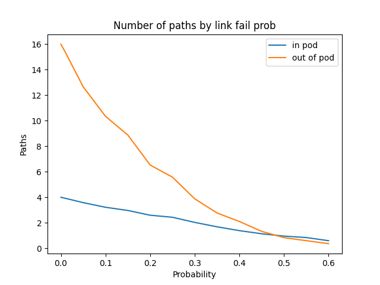
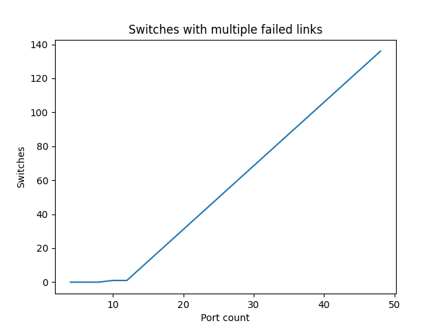
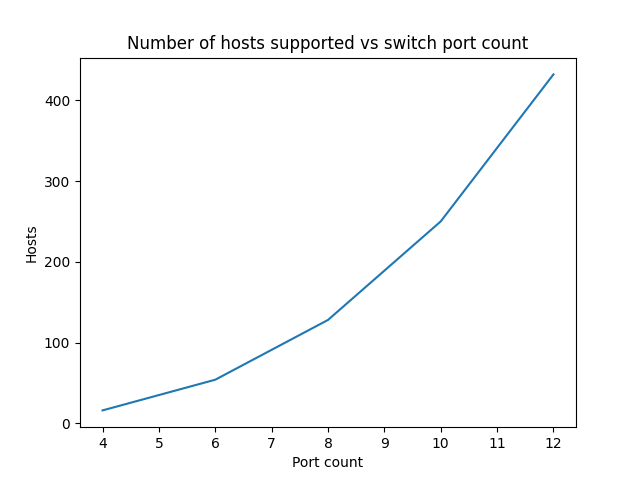

# Fat-Tree Topology Simulator

This repository contains a simple simulator for k-ary fat-tree topologies.  
It runs three small experiments that build intuition about **path redundancy**, **failure impact**, and **scalability**.  
Each experiment has tunable parameters in the code and produces a Matplotlib figure that is also embedded below.

---

## 1. Average paths vs. link failure probability

**Purpose**  
Estimate how the number of parallel paths between leaf switches degrades as links randomly fail. The experiment separates:

- **In-pod paths** – between two leaves in the same pod.  
- **Out-of-pod paths** – between leaves in different pods.

**Changeable parameters**

- `k_for_paths: int` – switch port count, must be even.  
- `probs: List[float]` – list of link failure probabilities to simulate.  
- `trials: int` – number of Monte‑Carlo repetitions per probability value.

**Result** 
for `k = 8` and avaraged acrossed 10 trials.

- At **0% link failure**, out‑of‑pod pairs enjoy many more paths than in‑pod pairs, reflecting the rich connectivity through the spine layer.  
- As failure probability increases, both curves drop roughly monotonically: redundancy is quickly eroded.  
- Around **40–50%** failure probability, the expected number of surviving paths is close to **1** in both cases; above that, many leaf pairs are effectively disconnected.  
- The gap between in‑pod and out‑of‑pod paths shrinks at high failure rates, showing that heavy failures “flatten” the topological advantage of extra core paths.

This experiment provides a visual intuition for how much path diversity can realistically be relied on under different failure regimes.

---

## 2. Switches with multiple failed links at 1% failure rate

**Purpose**  
For different values of `k`, count how many switches end up with **more than two failed links** when each link fails independently with probability **1%**. This captures how vulnerable high‑degree switches are to accumulating multiple faults.

**Changeable parameters**

- `k_1p_fail: List[int]` – list of port counts to evaluate.

**Result**
avaraged acrossed 10 trials.

- For small port counts (e.g., `k = 6, 8`), almost no switches suffer more than two link failures.  
- As `k` increases (towards high‑port switches such as `k = 48`), the number of switches with multiple failed links grows **almost linearly**, exceeding one hundred in this example.  
- Intuitively, even with a modest **1%** per‑link failure rate, high‑degree switches are much more likely to accumulate several simultaneous link faults simply because they host more links.

This highlights a design trade‑off: larger `k` improves scalability, but it also increases the probability that individual switches experience multiple concurrent failures.

---

## 3. Supported hosts vs. port count `k`

**Purpose**  
Visualize how the theoretical host capacity of a k‑ary fat‑tree scales with the switch port count.

**Changeable parameters**

- `k_hosts: List[int]` – port counts to plot.

**Result**

- In a classic k‑ary fat‑tree, the number of supported hosts grows on the order of **O(k³)** (specifically `k³ / 4`).  
- In the sample plot:
  - `k = 4` supports on the order of tens of hosts,  
  - `k = 8` supports roughly ~128 hosts,  
  - `k = 12` already reaches ~432 hosts.
- The curve is very steep: modest increases in per‑switch port count lead to **dramatic improvements** in total host capacity.

This experiment makes the scalability of fat‑trees visually clear and motivates why large port‑count switches are attractive in data‑center designs—despite the reliability trade‑offs shown in Experiment 2.

